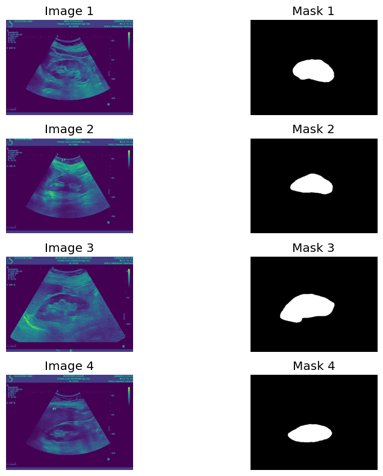
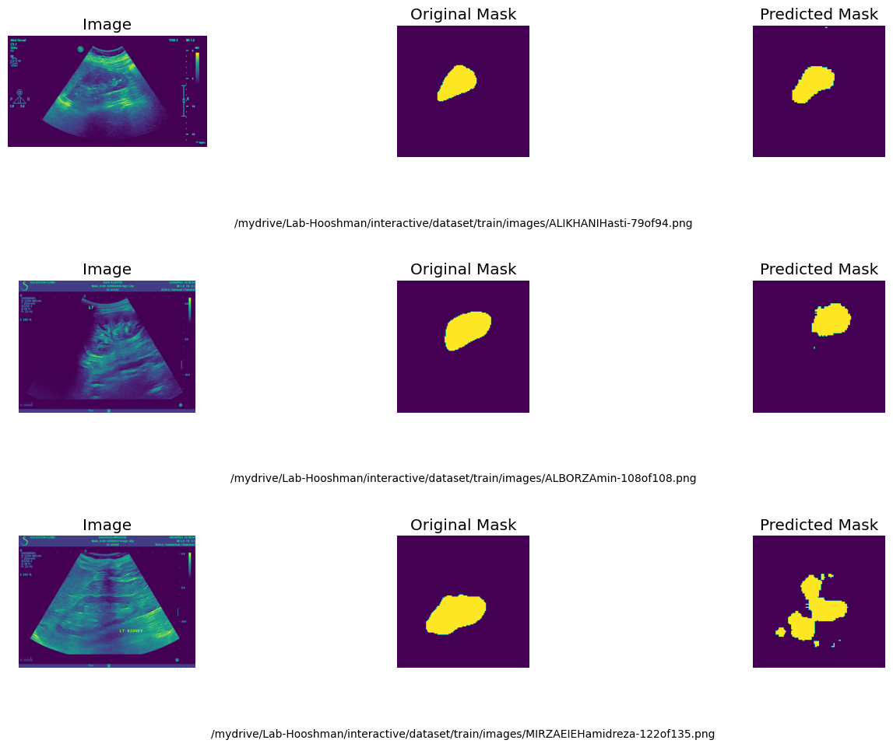
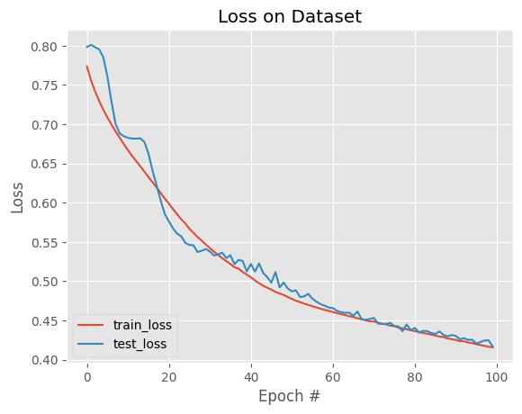
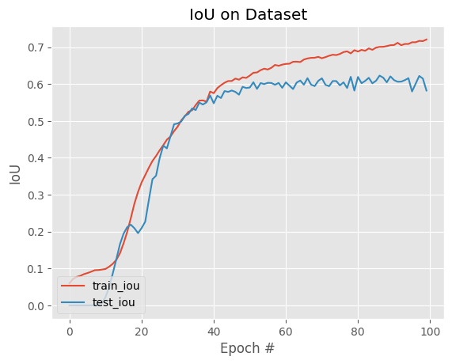
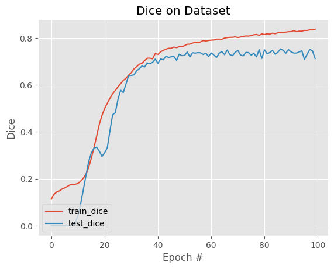

# Segmentation Model for Medical Image Segmentation

This repository contains a deep learning model for medical image segmentation using U-Net. The model is trained on a dataset of medical images and corresponding masks.

<a href="https://colab.research.google.com/drive/1wv1kaT5SAU6j1UL3v6jlGeuSwmR-Tij0?usp=sharing"></a>

## Sample Input, Output and Mask

### Input and Mask Image:


### Input, Output and Mask:


## Loss Diagrams

### Training and Validation Loss:


### Training and Validation IoU:


### Training and Validation Dice:


## Requirements

You can install the necessary dependencies by running:

```bash
pip install -r requirements.txt
